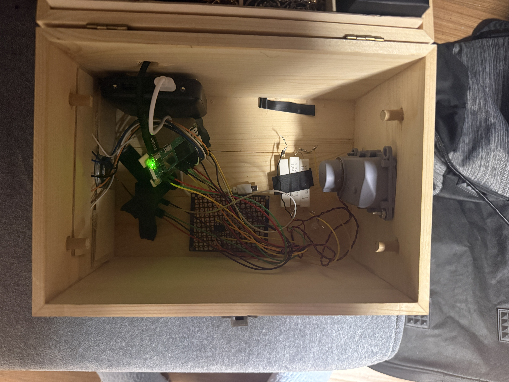
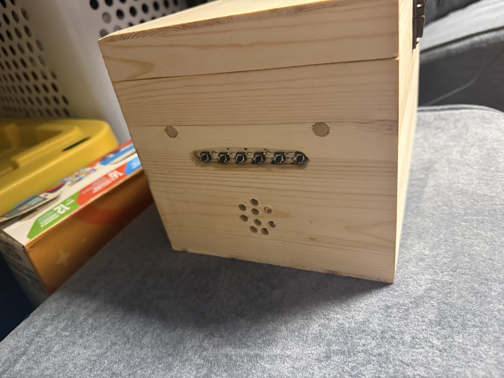

# Christmas Musicbox

This is a project I made for my girlfriend, **Alaina**, for Christmas 2025. The music box is built using a **Raspberry Pi Zero 2 W**, an **MCP3202 ADC**, three resistors, and a hand crank purchased from Amazon.

For audio output, I used an I2S breakout board for the Raspberry Pi that functions as both an amplifier and DAC:

**MAX98357A**
[https://www.adafruit.com/product/3006](https://www.adafruit.com/product/3006)

This is connected to a **1-watt, 8-ohm speaker**. The music box supports **mono output only**.

The enclosure and buttons were purchased from Amazon, and all other electrical components were sourced from Digi-Key.

Internally, the system functions as a simple music player, but with:

* Crank speed controlling playback speed
* Buttons for volume control
* Playlist navigation
* Mode switching
* Playlist updating via the internet

---

## Internal Design

  
  

Above are the internals of the music box.

* **Top right:** A portable phone battery bank (from Amazon). I mistakenly bought one **without pass-through charging**, so it is not wired into the system. The box is powered via a separate Micro-USB cable connected directly to the Pi.
* **Top section:** A wooden button board with **7 wires** (one per GPIO button plus a common ground). This board is glued to the side. The second image shows the external view.
* **Below the buttons:** The speaker, connected to the DAC/amp board, which connects to the Pi.
* **Left side:** The **MCP3202 ADC** mounted on perfboard (secured with double-sided tape). It has 6 connections to the Pi:

  * MISO
  * MOSI
  * CS/SHUTDOWN
  * GND
  * VIN
  * VREF
* **Bottom section:** A three-resistor voltage divider that reduces the hand crank output (up to ~25V) down to roughly **0–4.5V** for the ADC.
* **Very bottom:** The hand crank.
* The Pi itself is unsecured inside the box. Electrical tape failed, but it has worked fine floating, so it was left as is.

---

## Button Interface

From left to right:

**VOLUME UP | VOLUME DOWN | SKIP SONG | PREVIOUS SONG | MODE SWITCH | UPDATE PLAYLIST**

### Volume Up / Down

Adjusts the strength of the **mpv gain filter**.

### Skip / Previous Song

Moves forward or backward in the **mpv playlist**.

### Mode Switch

Switches between three playback modes:

1. **Crank controls playback speed**

   * Music stops when the crank stops
2. **Crank controls play/pause only**

   * Playback speed remains at 1.00×
3. **Normal playback**

   * Music plays continuously, no cranking required

### Update Playlist

Triggers a download thread that (if connected to the internet):

1. Runs a `yt-dlp` process to download new songs from a YouTube playlist
2. Runs another `yt-dlp` process to generate a `playlist.m3u` file

`yt-dlp` uses `--download-archive` to avoid re-downloading songs.
When the update finishes, **mpv reloads the playlist**.

If there is no internet connection, an error is printed and nothing happens.

---

## The Code

Ironically, the code was supposed to be the easiest part (after the box design and soldering). As the commit history shows, that did not go as planned. Below is an overview of the main files.

### `mcp3202.c`

Initializes SPI communication with the ADC, reads the 12-bit response, and converts it into a C integer.

### `speedloop.c`

An infinite loop that adjusts song playback speed based on the current mode (shared variable).

### `gpio.c`

Initializes the Pi’s GPIO using the **wiringPi** library (planned migration to **libgpiod**).

### `buttons.c`

Polls for button presses and performs the corresponding actions. Also checks for playlist updates and reloads the playlist if needed.

### `musicbox.c`

Main program entry point. Initializes mpv, starts external threads (Buttons, mpv events, Update thread), and calls `speed_loop()`.

### `playlist.c`

Handles playlist downloading and updating in a separate thread:

1. Checks if another download thread is active and waits if necessary
2. Spawns a `yt-dlp` process using `posix_spawnp()` to download songs
3. Waits for completion and reports errors (common issues: age-restricted videos or connection/HTTP errors)
4. Spawns another `yt-dlp` process using `--flat-playlist` to print entries to STDOUT
5. Uses file descriptors and POSIX file actions to write to a temporary playlist file
6. If this step fails, the program exits (typically indicates no internet connection)
7. Compares the temporary playlist with the old one

   * If unchanged, exit
   * If changed, replace the old playlist using `unlink()` and copy
8. Sets the updated flag and unlocks the mutex

**Future improvement:** Add an audio cue to indicate errors.

---

